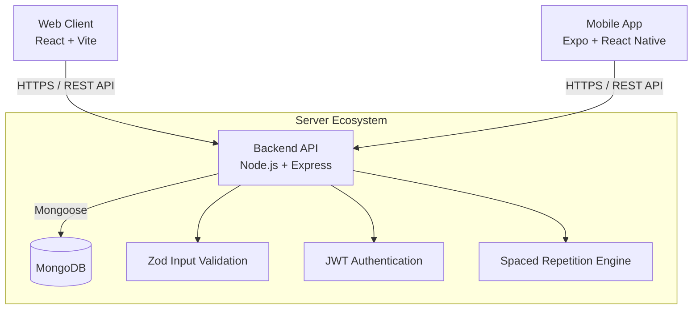

# Pattern Retainer

Pattern Retainer is a full-stack learning and spaced repetition application designed to help users retain information over long periods. Built with a unified backend serving both a responsive Web Application and a cross-platform Mobile App, it automatically schedules review sessions based on spaced repetition algorithms.

## 🚀 Features

- **Spaced Repetition Algorithm**: Automatically calculates the next review date based on user-reported difficulty (Easy, Good, Hard).
- **Cross-Platform**: Access your learnings anywhere via the React Web App or the React Native Mobile App.
- **RESTful API Backend**: Secure, validated Express API powered by Node.js and MongoDB.
- **Progress Tracking**: View statistics, streaks, and stage breakdowns on an intuitive dashboard.
- **Modern UI**: Styled with Tailwind CSS and NativeWind for a clean, responsive, and accessible user experience.

## 🏗️ Architecture

Below is a high-level system architecture diagram for Pattern Retainer:



## 🛠️ Tech Stack

**Frontend (Web)**
- React 19 (Vite)
- Tailwind CSS 4
- Axios
- React Router DOM

**Frontend (Mobile)**
- React Native
- Expo Router
- NativeWind (Tailwind for RN)
- Expo Notifications

**Backend**
- Node.js & Express
- MongoDB & Mongoose
- Zod (Schema Validation)
- JWT & bcryptjs (Authentication & Security)
- Jest & Supertest (Testing)

## 📦 Installation & Setup

### Prerequisites
- Node.js (v18 or higher)
- MongoDB (Local instance or MongoDB Atlas cluster)
- Expo Go app on your phone (for testing the mobile app)

### 1. Server Setup
```bash
cd server
npm install

# Create a .env file and configure the environment variables
# Requires: NODE_ENV, MONGO_URI, JWT_SECRET, ALLOWED_ORIGINS
cp .env.example .env

npm run dev
```
*The server will run on port 5000 by default.*

### 2. Web Client Setup
```bash
cd client
npm install

npm run dev
```
*The web app will run on port 5173 by default.*

### 3. Mobile App Setup
```bash
cd mobile
npm install

npm start
```
*Scan the QR code with the Expo Go app to view on your physical device, or press 'a'/'i' to run on an emulator.*

## 🧠 Spaced Repetition Logic

Pattern Retainer uses a modified SuperMemo-style algorithm. When reviewing a topic, you select a difficulty:
- **Hard**: Your stage decreases, forcing a review sooner to reinforce the concept.
- **Good**: Your stage advances by 1, doubling the interval (capped at 90 days).
- **Easy**: Your stage advances by 2, significantly increasing the interval.

## 🛡️ Testing & Security
- **Data Validation**: All incoming requests are validated against strict Zod schemas to ensure data integrity.
- **Error Handling**: Centralized error middleware ensures predictable API responses and prevents crashes.
- **Unit Testing**: The core spaced repetition logic is fully tested using Jest. Run `npm test` in the `server` directory to execute the test suite.
